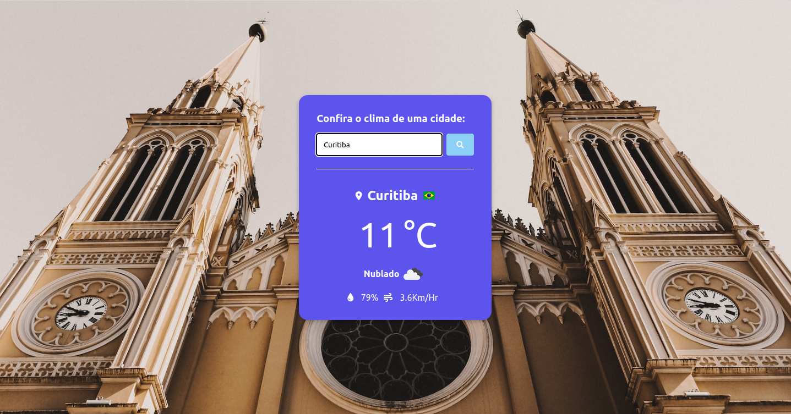

# Monitor climático

Neste projeto foi construído um monitor climático,
utilizando JavaScript/HTML e CSS. Para seu funcionamento
utilizou-se 3 API'S sendo a primeira Weather API 
https://openweathermap.org/api, (necessário fazer cadastro
no plano Free para conseguir sua Key). A segunda é a Country Flag https://countryflagsapi.com
utilizada para mostrar as bandeiras de cada país,conforme a cidade na barra de busca
e, por por último, a Unsplash https://source.unsplash.com que faz a buscas
das imagens que aparecem no background de acordo com a cidade pesquisada.

Para utilizar o projeto clone-o no seu pc e realize o cadastro na API Weather para obter sua KEY.
## Demo
Por motivos de segurança o projeto não funciona no modo pages, então segue o video de funcionamento:

https://user-images.githubusercontent.com/79283588/190292325-285d65b7-7f6c-48c6-ad41-c09ddc922ae5.mp4

## Instalação


Rode o projeto pelo método de clone disponível neste respositório.

```bash
  git clone https://github.com/davi33-emanoel/monitor-de-clima.git
```
Depois de clonado na pasta desejada, abra o vscode e 
na pasta js crie um arquivo :
```bash
    config.js
```
Coloque sua key conforme demonstrado no arquivo:
 ```bash 
  exemploConfig.js
``` 
Em seu vscode, abra o arquivo index.html para visualizar o projeto em seu navegador.
## Uso

Digite no campo a cidade para a qual deseja visualizar o clima, conforme demonstrado abaixo.

<p textAlign="center">

</p>
